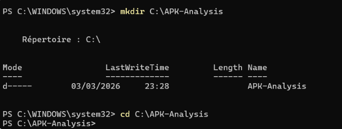
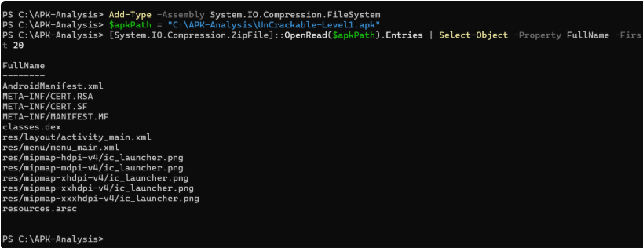

# 🔍 Android APK Static Analysis Lab
## Analyse Statique d’Applications Android avec JADX, dex2jar et JD-GUI

---

# 📌 Présentation du Lab

Ce laboratoire pédagogique introduit les bases de l’analyse statique d’applications Android à travers l’étude d’un fichier APK autorisé.

L’objectif est de comprendre :

- la structure interne d’un APK ;
- le rôle du fichier AndroidManifest.xml ;
- les mécanismes de décompilation Android ;
- l’identification de mauvaises pratiques de sécurité ;
- l’analyse des composants exportés ;
- l’évaluation des risques de sécurité mobile ;
- la rédaction d’un mini-rapport d’audit professionnel.

Ce laboratoire est réalisé dans un environnement strictement pédagogique et contrôlé.

---

# 🎯 Objectifs pédagogiques

À la fin de ce laboratoire, il sera possible de :

- Comprendre la structure interne d’un APK ;
- Explorer AndroidManifest.xml ;
- Identifier les permissions Android demandées ;
- Identifier les composants exportés ;
- Décompiler une application avec JADX GUI ;
- Convertir des fichiers DEX en JAR avec dex2jar ;
- Analyser le code Java avec JD-GUI ;
- Identifier des vulnérabilités courantes ;
- Évaluer le niveau de risque ;
- Produire un mini-rapport d’analyse statique professionnel.

---

# 🛠️ Outils utilisés

| Outil | Rôle |
|---|---|
| JADX GUI | Décompilation et analyse APK |
| dex2jar | Conversion DEX → JAR |
| JD-GUI | Lecture du code Java décompilé |
| unzip | Extraction APK |
| apksigner | Vérification de signature |
| keytool | Informations certificat |

---

# 📦 Prérequis

- Windows / Linux / macOS
- Java installé
- APK autorisé
- Android Studio (optionnel)

---

# ⚠️ Règles de sécurité

## ✅ Autorisé

- Analyse d’APK personnels ;
- Applications de cours ;
- APK fournis par l’enseignant ;
- Données fictives.

---

## ❌ Interdit

- Analyse d’applications tierces non autorisées ;
- Exploitation de vulnérabilités ;
- Utilisation de données réelles ;
- Publication de secrets découverts.

---

# 📚 Glossaire

| Terme | Définition |
|---|---|
| APK | Package Android contenant code et ressources |
| DEX | Bytecode Android |
| Manifest | Configuration principale Android |
| Décompilation | Transformation du bytecode en code lisible |
| Obfuscation | Protection rendant le code difficile à lire |
| Exported | Composant accessible par d'autres applications |
| Signature | Vérification d’intégrité d’une application |

---

# 🧩 Architecture d’un APK

```text
APK
│
├── AndroidManifest.xml
├── classes.dex
├── classes2.dex
├── res/
├── assets/
├── lib/
├── META-INF/
└── resources.arsc
```

---

# 🚀 Task 1 — Préparer le Workspace

## 🎯 Objectif

Créer un environnement de travail propre et vérifier l’intégrité de l’APK.

---

# 📂 Création du dossier de travail

## Windows

```powershell
mkdir C:\APK-Analysis
cd C:\APK-Analysis
```

## Linux/macOS

```bash
mkdir ~/APK-Analysis
cd ~/APK-Analysis
```

---

# 📥 Copier l’APK

Placez l’APK dans le dossier :

```text
APK-Analysis/
```

---

# 🔎 Vérifier que l’APK est une archive ZIP

## Windows

```powershell
Get-Content -Path .\app-debug.apk -TotalCount 4 | Format-Hex
```

## Linux/macOS

```bash
hexdump -n 4 app-debug.apk
```

Résultat attendu :

```text
50 4B
```

---

# 📸 Captures — Vérification APK

<p align="center">
  
</p>

<p align="center">
  
</p>

---

# 📦 Lister le contenu de l’APK

## Windows

```powershell
Add-Type -Assembly System.IO.Compression.FileSystem
$apk = Join-Path (Get-Location).Path "app-debug.apk"

[System.IO.Compression.ZipFile]::OpenRead($apk).Entries |
Select-Object -ExpandProperty FullName -First 20
```

## Linux/macOS

```bash
unzip -l app-debug.apk | head -20
```

---

# 📸 Capture — Structure APK

<p align="center">
  
</p>

---

# 🔐 Calculer le hash SHA-256

## Windows

```powershell
Get-FileHash -Algorithm SHA256 .\app-debug.apk
```

## Linux/macOS

```bash
sha256sum app-debug.apk
```

---

# 📸 Capture — Hash APK

<p align="center">
  
</p>

---

# ✅ Checkpoint

- [ ] Workspace créé
- [ ] APK vérifié
- [ ] Hash SHA-256 documenté
- [ ] Structure APK identifiée

---

# 📦 Task 2 — Obtenir l’APK

# 🎯 Objectif

Utiliser un APK valide pour l’analyse.

---

# Option A — APK fourni

Utiliser un APK de cours ou fourni par l’enseignant.

---

# Option B — Générer un APK avec Android Studio

```text
Build → Build APK(s)
```

Chemin généré :

```text
app/build/outputs/apk/debug/app-debug.apk
```

---

# 📸 Capture — Génération APK

<p align="center">
  
</p>

---

# Option C — Extraire un APK

Utiliser :

```text
APK Extractor
```

---

# 📸 Capture — APK Extractor

<p align="center">
  
</p>

---

# ✅ Checkpoint

- [ ] APK disponible
- [ ] Provenance documentée
- [ ] Taille notée

---

# 🔍 Task 3 — Analyse avec JADX GUI

# 🎯 Objectif

Explorer la structure interne de l’APK.

---

# ▶️ Lancer JADX GUI

## Windows

```powershell
start "" "C:\Path\to\jadx-gui.exe"
```

## Linux/macOS

```bash
/path/to/jadx-gui
```

---

# 📂 Ouvrir l’APK

```text
File → Open File
```

---

# 📸 Capture — JADX GUI

<p align="center">
  
</p>

---

# 📑 Explorer AndroidManifest.xml

Identifier :

- package principal ;
- versionName ;
- minSdk ;
- targetSdk ;
- permissions ;
- composants ;
- activités exportées.

---

# 📸 Capture — AndroidManifest.xml

<p align="center">
  
</p>

---

# 📌 Permissions importantes

Exemples :

```xml
<uses-permission android:name="android.permission.INTERNET"/>
<uses-permission android:name="android.permission.READ_CONTACTS"/>
```

---

# 📌 Composants exportés

Exemple :

```xml
android:exported="true"
```

---

# ⚠️ Configurations sensibles

Rechercher :

```xml
android:debuggable="true"
```

```xml
android:usesCleartextTraffic="true"
```

---

# 📸 Capture — Configurations sensibles

<p align="center">
  
</p>

---

# ✅ Checkpoint

- [ ] Package identifié
- [ ] Permissions listées
- [ ] Composants exportés identifiés
- [ ] Configurations sensibles documentées

---

# 🔎 Task 4 — Recherche de chaînes sensibles

# 🎯 Objectif

Identifier des secrets codés en dur.

---

# 🔍 Recherches recommandées

## URLs

```text
http://
https://
api
endpoint
server
```

---

## Secrets

```text
token
apikey
secret
password
jwt
oauth
```

---

## Debug

```text
DEBUG
debug
staging
test
dev
```

---

# 📸 Capture — Recherche de chaînes

<p align="center">
  
</p>

---

# 📊 Évaluation des risques

| Niveau | Description |
|---|---|
| Faible | Information publique |
| Moyen | Secret de développement |
| Élevé | Clé production / token réel |

---

# ✅ Checkpoint

- [ ] Recherche effectuée
- [ ] Observations documentées
- [ ] Risques évalués

---

# 🔄 Task 5 — Conversion DEX → JAR

# 🎯 Objectif

Convertir le bytecode Android en format Java.

---

# 📦 Extraction des fichiers DEX

## Windows

```powershell
mkdir dex_out
```

## Linux/macOS

```bash
mkdir -p dex_out
unzip -j app-debug.apk "classes*.dex" -d dex_out
```

---

# 📸 Capture — Extraction DEX

<p align="center">
  
</p>

---

# 🔄 Conversion avec dex2jar

## Windows

```powershell
.\d2j-dex2jar.bat classes.dex -o app.jar
```

## Linux/macOS

```bash
./d2j-dex2jar.sh classes.dex -o app.jar
```

---

# 📸 Capture — dex2jar

<p align="center">
  
</p>

---

# ✅ Checkpoint

- [ ] DEX extraits
- [ ] JAR généré
- [ ] Multi-dex traité

---

# 🧠 Task 6 — Comparaison JADX vs JD-GUI

# 🎯 Objectif

Comparer deux méthodes de décompilation.

---

# ▶️ Lancer JD-GUI

## Windows

```powershell
start "" "C:\Path\to\jd-gui.exe"
```

## Linux/macOS

```bash
/path/to/jd-gui
```

---

# 📸 Capture — JD-GUI

<p align="center">
  
</p>

---

# 📸 Capture — Comparaison code

<p align="center">
  
</p>

---

# 📊 Comparaison

| Aspect | JADX GUI | JD-GUI |
|---|---|---|
| Ressources Android | Oui | Non |
| Manifest | Oui | Non |
| Kotlin | Meilleur support | Limité |
| Obfuscation | Partielle | Faible |
| Navigation | Android complète | Java uniquement |

---

# ✅ Checkpoint

- [ ] Comparaison effectuée
- [ ] Différences documentées
- [ ] Forces/faiblesses identifiées

---

# 📝 Task 7 — Mini Rapport d’Audit

# 🎯 Objectif

Rédiger un rapport professionnel.

---

# 📋 Structure recommandée

## Informations générales

```text
Date
Analyste
Nom APK
Version
Source
Outils utilisés
```

---

## Résumé exécutif

Exemple :

```text
Cette analyse a révélé plusieurs vulnérabilités potentielles.
Le niveau de risque global est évalué comme moyen.
```

---

# 📌 Exemple de constat

## Constat #1 — Secret codé en dur

**Sévérité :** Élevée

**Description :**
Une clé API a été trouvée dans le code source.

**Localisation :**
com.example.api.ApiConfig.java

**Impact :**
Utilisation frauduleuse de l’API.

**Remédiation :**
Stocker les secrets côté serveur.

---

# 📌 Exemple de constat

## Constat #2 — Application débogable

**Sévérité :** Moyenne

**Description :**
L’attribut :

```xml
android:debuggable="true"
```

est activé.

**Impact :**
Facilite l’analyse et le reverse engineering.

**Remédiation :**
Désactiver le mode debug en production.

---

# 📌 Exemple de constat

## Constat #3 — Trafic HTTP autorisé

**Sévérité :** Moyenne

**Description :**
L’application autorise le trafic non chiffré.

**Impact :**
Risque d’interception réseau.

**Remédiation :**
Forcer HTTPS uniquement.

---

# 📸 Capture — Résultats analyse

<p align="center">
  
</p>

---

# ✅ Checkpoint

- [ ] Rapport rédigé
- [ ] 3 constats minimum
- [ ] Remédiations proposées
- [ ] Format professionnel

---

# 🧹 Task 8 — Nettoyage

# 🎯 Objectif

Nettoyer l’environnement d’analyse.

---

# 📂 Organiser les résultats

## Windows

```powershell
mkdir .\results
move .\app.jar .\results\
```

## Linux/macOS

```bash
mkdir ./results
mv ./app.jar ./results/
```

---

# 🗑️ Supprimer les artefacts temporaires

## Windows

```powershell
Remove-Item -Recurse -Force .\dex_out
```

## Linux/macOS

```bash
rm -rf ./dex_out
```

---

# 📸 Capture — Nettoyage

<p align="center">
  
</p>

---

# ⚠️ Troubleshooting

| Problème | Solution |
|---|---|
| JADX ne s’ouvre pas | Vérifier Java |
| dex2jar échoue | Utiliser la bonne version |
| Code illisible | Présence d’obfuscation |
| Out of memory | Augmenter RAM Java |
| Multi-dex | Convertir chaque DEX |

---

# 📋 Deliverables Checklist

- [ ] Mini-rapport d’analyse
- [ ] Liste des permissions
- [ ] Liste des composants exportés
- [ ] 3 constats minimum
- [ ] Remédiations proposées
- [ ] Captures d’écran
- [ ] JAR généré

---

# 🎓 Conclusion

Ce laboratoire introduit les fondamentaux de l’analyse statique Android dans un environnement pédagogique contrôlé.

Les compétences acquises incluent :

- compréhension de la structure APK ;
- analyse du manifeste Android ;
- décompilation Android ;
- identification de mauvaises pratiques de sécurité ;
- rédaction de rapports d’audit.

L’objectif principal n’est pas l’exploitation offensive mais l’apprentissage des mécanismes de sécurité mobile et des bonnes pratiques de développement sécurisé.

---

# 📖 Informations

```text
Lab : Android APK Static Analysis
Type : Analyse Statique Android
Niveau : Débutant / Intermédiaire
Objectif : Compréhension sécurité mobile
Environnement : Contrôlé et pédagogique
```
